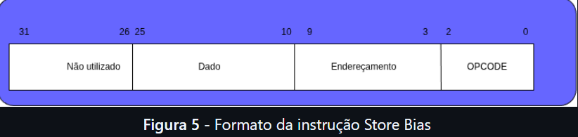
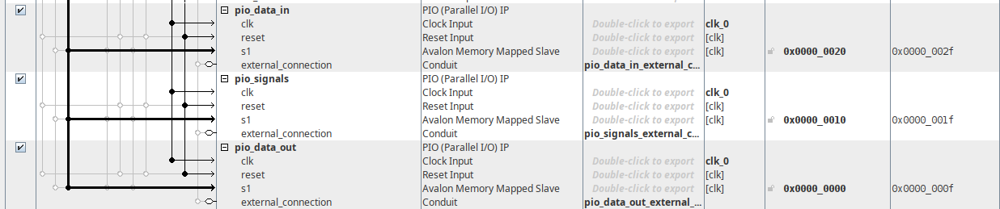
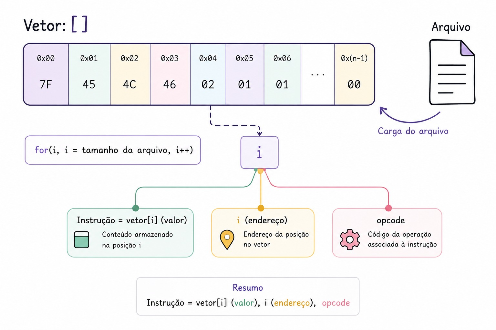
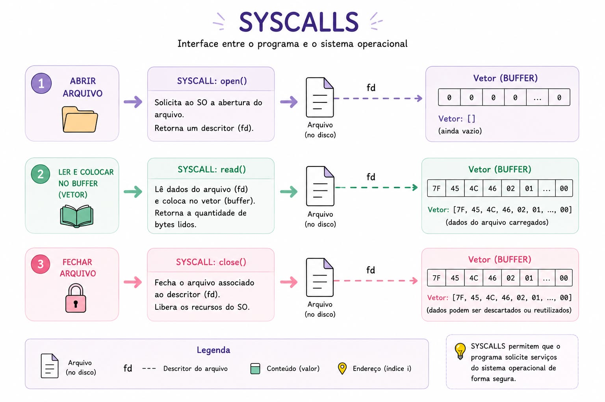
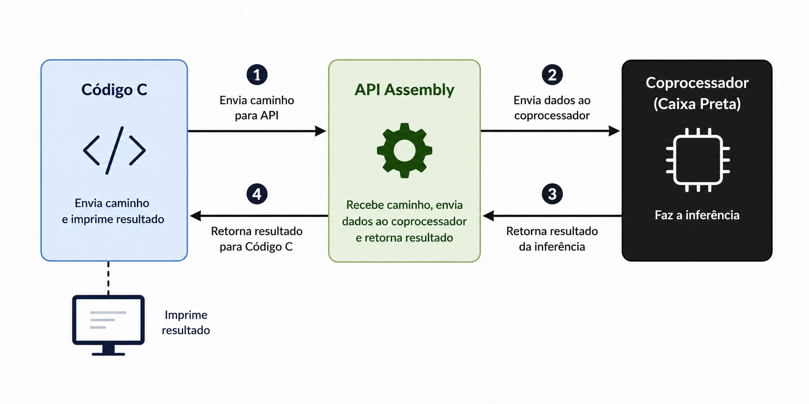
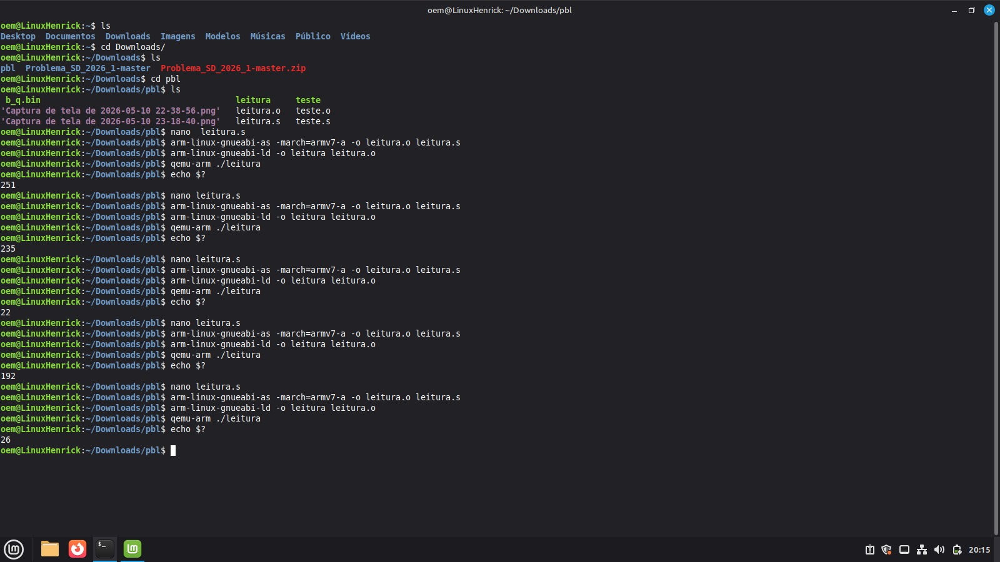

# Marco-2
# Projeto Coprocessador - Sistemas Digitais (PBL)
Este repositório contém o desenvolvimento de um coprocessador para a disciplina de Sistemas Digitais.

- [Introdução e Definição do Problema](#introdução-e-definição-do-problema)
   - [Requisitos Principais](#requisitos-principais)
   - [Fundamentação Teórica](#fundamentação-teórica)
      - [MMIO (Memory-Mapped I/O)](#mmio-memory-mapped-io)
      - [Drive /dev/mem e Syscalls](#Drive-/dev/mem-e-Syscalls)
      - [Endianness Big/Little](#Endianness-Big/Little)
- [Materiais e Métodos](#materiais-e-métodos)
   - [Materiais](#materiais) 
      - [DE1-SoC](#de1-soc)
      - [Quartus Prime](#quartus-prime)
      - [Co-processador ELM](#co-processador-elm)
         - [Descrição](#descrição)
         - [Barramentos](#barramentos)
         - [ISA — Conjunto de Instruções](#isa--conjunto-de-instruções)
   - [Metodologia](#metodologia)
- [Descrição da Solução](#descrição-da-solução)
   - [Arquitetura Geral](#arquitetura-geral)
   - [Funções Implementadas](#funções-implementadas)
   - [Montagem da Instrução de 32 bits](#montagem-da-instrução-de-32-bits)
   - [Protocolo de Envio — Enable e Polling](#protocolo-de-envio--enable-e-polling)
   - [Leitura dos Arquivos .bin](#leitura-dos-arquivos-bin)
   - [Fluxo de Execução](#fluxo-de-execução)
- [Modo de Uso](#modo-de-uso)
- [Testes e Resultados](#testes-e-resultados)
- [Referências](#referências)
---

# Introdução e Definição do Problema
Este projeto faz parte do Marco 2, da disciplina de SD (Sistemas Digitais) - TEC499, que tem como objetivo realizar a integração entre o co-processador ELM implementado na FPGA(do marco1, projetado por um monitor da referente materia) e o sistema Linux executando no HPS da placa DE1-SoC. O co-processador, desenvolvido em Verilog no Marco 1, é responsável por executar a inferência do modelo ELM diretamente em hardware.

No Marco 2, o foco principal é permitir que o processador ARM consiga se comunicar corretamente com o co-processador através de MMIO (Memory-Mapped I/O), utilizando as bridges entre HPS e FPGA disponíveis na placa. Para isso, foi utilizada a ferramenta Platform Designer no Quartus Prime para integrar o hardware ao sistema do HPS.

O principal desafio desta etapa é garantir que a comunicação entre o Linux e o co-processador funcione de forma correta e estável, permitindo o envio e leitura de dados sem erros de sincronização. Para isso, foi necessário mapear os registradores do módulo, configurar a comunicação entre HPS e FPGA e implementar as funções de acesso ao hardware.

Ao final deste marco, o sistema deve estar apto para que, no Marco 3, uma aplicação em linguagem C consiga utilizar o co-processador através do driver desenvolvido.

## Requisitos Principais

**Integração HPS↔FPGA**

**Driver Linux em Assembly ARM**

**Comunicação via MMIO**

**Controle do Co-processador**

**Leitura e Envio de Dados**

**Demonstração de Estabilidade**

## Fundamentação Teórica
Para a elaboração do Driver, alguns conceitos importantes precisam ser mencionados:

### MMIO (Memory-Mapped I/O)
MMIO (Memory-Mapped I/O) é uma forma de comunicação onde os registradores 
do hardware funcionam como posições de memória. Na prática, isso significa 
que o Linux consegue controlar o co-processador apenas lendo e escrevendo 
em determinados endereços de memória. Dessa forma, é possível enviar dados 
para a FPGA, iniciar a inferência e depois ler o resultado retornado pelo 
hardware.

### Drive /dev/mem e Syscalls
O /dev/mem é um recurso do Linux que permite acessar diretamente regiões 
da memória física do sistema. No nosso projeto, ele foi utilizado para acessar 
os registradores do co-processador conectados pela Lightweight Bridge.

Para fazer esse acesso, o programa utiliza syscalls, que são chamadas ao 
sistema operacional. Funções permitem abrir o /dev/mem, mapear os 
endereços da FPGA na memória do programa e depois liberar os recursos 
utilizados.

A syscall mais importante no nosso processo é o mmap(), porque é ela que 
faz o mapeamento do endereço físico da FPGA, como o 0xFF200000, para o 
espaço de memória do processo. Na prática, isso permite que o código em 
Assembly consiga acessar os PIOs diretamente utilizando ponteiros, como 
se estivesse acessando variáveis normais da memória.

### Endianness Big/Little 

Durante o desenvolvimento do nosso driver em Assembly ARM, foi encontrado um problema com big e little endian durante a leitura de alguns arquivos. 
Endianness é resposavel pela ordem em que os bytes de um valor são armazenados na 
memória. Os arquivos .bin dos pesos e bias foram gerados em big-endian, 
enquanto o processador ARM da DE1-SoC trabalha em little-endian.

Com isso, ao utilizar a instrução ldrh para ler valores de 16 bits, os 
bytes eram interpretados na ordem errada de maneira invertida.

---

# Materiais e Métodos

## Materiais

### DE1-SoC

A DE1-SoC é a placa utilizada no nosso projeto. Ela junta duas partes principais: 
o HPS, que é o processador ARM responsável por rodar o Linux, e a FPGA, 
onde o co-processador ELM foi implementado em Verilog.

Como essas duas partes precisam se comunicar e trocar informações, a placa possui bridges 
que fazem essa comunicação. No noaso projeto foi utilizada a Lightweight Bridge, decidido e apresentado em uma das seções tutoriais,  
que permite que o processador ARM consiga acessar os registradores do 
hardware na FPGA de forma mais simples e direta.

### Platform Designer - Quartus

O Platform Designer é uma ferramenta dentro do Quartus, apresentada durante 
uma das sessões de desenvolvimento no laboratório. Com ela é possível montar 
a ligação entre o HPS e a FPGA de forma visual.

No projeto foram adicionados 3 PIOs e conectados ao HPS através da 
Lightweight Bridge:

PIO Data In — 32 bits, saída — envia instruções ao co-processador

PIO Signals — 3 bits, saída — envia os sinais Enable, Clear e Reset

PIO Data Out— 32 bits, entrada — recebe as flags e o resultado

Após a conexão de tudo, o Platform Designer atribuiu automaticamente 
endereços de memória para cada PIO:

Data In = 0xFF200020
Signals = 0xFF200010
Data Out = 0xFF200000

Esses endereços são os que o driver utiliza para se comunicar com o 
co-processador via MMIO.

### Co-processador ELM

#### Descrição

O co-processador foi cedido aos grupos e foi implementado pelo monitor da 
disciplina, Maike. Com ele foi entregue uma descrição detalhada e formatada 
contendo modo de uso, barramentos, unidade de controle, de inferencia, load/store e ISA. Com ele em 
mãos, iniciamos o processo de entender e analisar como funciona e 
principalmente como usaríamos no nosso projeto. De forma que em sessões 
tutoriais, foi bastante discutido que ele seria tratado como uma caixa preta, 
mas que nós teríamos que conectar, já que no Marco 2 isso é a base do 
problema conectar a FPGA com o HPS.

Para mais detalhes sobre a implementação, ver nas referências o repositório do monitor Maike. Ainda assim, é importante para o projeto entender sobre as entradas e saídas do co-processador
#### Barramentos

O co-processador possui 3 barramentos principais, dois de entrada e um de 
saída.

**Data In** barramento de entrada de 32 bits utilizado exclusivamente para 
o envio das instruções ao co-processador. Os 32 bits são preenchidos de 
acordo com a instrução que será executada.

**Signals** barramento de entrada de 3 bits utilizado para enviar os sinais 
de controle externos ao co-processador. Cada bit possui uma utilidade:

**Data Out** é o único barramento de saída, com largura de 32 bits, porém nem 
todos os bits são utilizados:

#### ISA — Conjunto de Instruções

O co-processador possui 8 instruções, sendo 5 de memória e 1 de controle, 
além de 2 não utilizadas no projeto. 
O formato de cada instrução varia devido a quantidade de bits destinada para cada endereço ou valor, mas no geral apresenta o seguinte formato:

  
    
  <em>Figura 1: Montagem da instrução de Bias no coprocessador base.</em>

## Metodologia

O desenvolvimento do Marco 2 foi realizado seguindo a metodologia PBL, 
avançando de forma crescente ao longo das sessões tutoriais, com cada seção com metas, ideias e fatos que auxiliaram de forma coletiva o avanço do projeto. 
Detalharei na sequência como nosso grupo desenvolveu a solução.

**Passo 1:**
 Entender o funcionamento do co-processador base, como era feita a comunicação e os barramentos de entrada / saída, alguns conceitos linux e instalação de ferramentas.

**Passo 2:**
 Com base nos roteiros apresentados, percebeu-se a necessidade da implementação dos PIO's atráves do Platform Designer do Quartus, então, junto com monitores da disciplina, implementamos a conexão e os endereços base dos barramentos. Menciona-se também que foi disponibilizado um projeto intitulado "my_first_hps-fpga_base" que serviu de top-level para o co-processador ser instanciado.

 

  
     
  <em>Figura 2: Screenshot do Platform Designer.</em>

 **Passo 3:**
  Durante as sessões, foram discutidos pseudocódigos e conceitos que nos ajudariam no desenvolvimento, chegamos a seguinte conclusão para a leitura do arquivo e montagem da instrução:
  

  
    
  <em>Figura 3: Pseudocódigo apresentado nas sessões (gerado com IA).</em>

Ou seja, um vetor com o conteúdo do arquivo e um loop percorrendo as posições, em que a posição serviria de endereço e o valor seria o dado, por fim, colocaria o opcode e finalizaria a montagem da instrução.
Mas como tranformar um arquivo em um vetor? Apresentamos dois conceitos importantes: Syscall e buffer - detalhados posteriormente.

 **Passo 4:**
  Após a conclusão de que esse era o caminho, iniciamos o desenvolvimento em assembly para a função store_bias (que seria a mais simples de implementar). 
  Aplicando o conceito de chamadas ao sistema, conseguimos imprimir o valor de qualquer posição do vetor (com offset), vimos que com o loop conseguiríamos montar a instrução, mas esbarramos com problemas de endianess (que será abordado mais na frente nos testes).
  Ainda nessa etapa, com estratégias lógicas (shift's, and's, or's), imprimimos o formato da instrução seguindo o padrão estabelecido.
  
**Passo 5:**
Posteriormente, montamos o loop e consequentemente todas as outras funções de armazenamento de dados (atenção as funções de armazenar imagem e peso, que apesar de apresentarem a mesma solução, possuem especifidades em relação ao tamanho do dado ou montagem da instrução).
Com auxílio de projetos de outros colegas, montamos também a função mapeia memória, as funções de envio e as de polling. Em tese, tudo pronto, mas como testar?
Esbarramos nessa etapa, visto que o co-processador base não tinha um modo de verificação da leitura e armazenamento dos dados.
A solução? Seguindo conselhos de colegas e monitores, montamos um código em C correspondente ao nosso para testar a inferência, se ela saísse correta, nosso projeto estaria funcional.

**Passo 6:**
Após a certeza de que nosso projeto estava funcional, começamos a elaborar o cabeçalho e uma aplicação em C que consumisse a API e automatizasse os testes, concluindo a finalização dos requisitos.

## Descrição da Solução

### Arquitetura Geral 

A arquitetura do nosso projeto que foi realizado, é composta por quatro blocos principais que 
trabalham de forma em sequencia e em conjunto parte por parte para realizar a classificação de um dígito que deve ser descrito.
O Driver Assembly ARM acessa o hardware através do /dev/mem, mapeando a 
Lightweight Bridge no espaço de memória do processo. Depois disso, as instruções chegam aos PIOs configurados no Platform Designer ferramenta do Quartus, que 
as mandam ao co-processador ELM na FPGA. O resultado,o dígito esperado
entre 0 e 9, e é retornado pelo barramento Data Out e mostrado no terminal. 

### Funções Implementadas

O driver desenvolvido no projeto possui um conjunto de funções responsáveis 
pela comunicação entre o software e o co-processador implementado no FPGA. 
Essas funções foram separadas em grupos para deixar a organização do sistema 
mais simples e facilitar o controle das operações realizadas durante a execução.

Estão divididas em 3 grandes grupos. As funções de **inicialização** são 
responsáveis por preparar a comunicação com o hardware — o sistema realiza 
o acesso à Lightweight Bridge através do /dev/mem, faz o mapeamento dos 
registradores em memória e configura os endereços que serão utilizados pelo 
driver durante a execução.

- mapeia_memoria abre /dev/mem e mapeia o endereço 0xFF200000 da Lightweight Bridge no espaço do processo
- reset_coprocessador reseta o co-processador antes de qualquer envio de dado (mas não apaga dados que ja estão na memória, isso vai ser importante e mais detalhado nos testes)

As funções de **envio de dados** são responsáveis por transmitir os dados 
necessários para a inferência ao co-processador, como os pesos, bias, beta 
e os pixels da imagem. Para isso o driver monta as instruções no formato 
esperado pelo hardware e escreve os valores nos registradores correspondentes.

- store_bias — lê b_q.bin e envia 128 instruções com OP=011
- store_beta — lê beta_q.bin e envia 1280 instruções com OP=100
- store_imagem — lê imagem.bin e envia 784 instruções com OP=000
- store_pesos — lê W_in_q.bin e envia 100352 pares de instruções OP=001 + OP=010

As funções de **comunicação com o hardware** são responsáveis pelo controle 
direto dos PIOs, realizando o envio de instruções com e sem polling, além 
do disparo da inferência e leitura do resultado.

- manda_instrução faz o papel de enviar instrução no formato de 32 bits e aguarda a flag Done subir
- manda_sem_espera envia instrução sem aguardar Done, usada exclusivamente para Store Weights Addr
- comeca_infer vai enviar a instrução Start, aguarda Done e retorna o dígito predito

### Leitura dos Arquivos .bin

Antes de enviar os dados para o co-processador, no nosso projeto o programa precisa ler os 
arquivos .bin usando syscalls do Linux em Assembly ARM. O processo segue 
sempre três etapas: abrir o arquivo, ler os dados para um buffer na RAM e 
depois fechar o arquivo.

  
    
  <em>Figura 4: Funcionamento das syscalls (gerado com IA).</em>

O open retorna um identificador chamado file descriptor, que é usado nas 
próximas operações. Em seguida, o read copia os bytes do arquivo para 
buffers declarados na memória do programa. Depois da leitura, o arquivo é 
fechado com close, liberando o recurso no sistema.

Cada arquivo possui um buffer próprio na RAM. 

Após a leitura, alguns valores ainda precisam ser convertidos antes de serem 
usados. Bias, beta e pesos são números de 16 bits com sinal, então o código 
inverte a ordem dos bytes (rev16) e faz extensão de sinal para 32 bits 
(sxth), já que os arquivos estão em big-endian e o ARM usa little-endian. 
A imagem não precisa desse tratamento porque cada pixel ocupa apenas 1 byte 
sem sinal.

### Montagem da Instrução de 32 bits

A comunicação entre o processador ARM e o co-processador do nosso projeto foi feito implementando na 
FPGA através de instruções de 32 bits definidas pela ISA do 
projeto. Cada instrução possui campos específicos e diferentes, como opcode, endereço 
e dado, ocupando posições fixas dentro desses 32 bits, como já visto 
anteriormente.

Por isso foi necessário que o software montasse manualmente cada instrução 
antes de enviá-la ao hardware. Esse processo foi implementado em Assembly 
ARM no arquivo (Assembly/driver.s).

As intruçoes foram contruidas com base princiapl em três operaçoes em assembly, sendo elas LSL, AND e ORR.  

A instrução (LSL) é utilizada para deslocar os bits para a esquerda, 
colocando cada informação na posição correta dentro da instrução de 32 bits.

Depois do deslocamento, foi necessário aplicar máscaras utilizando (AND)
para assegurar que o valor não ultrapassasse o tamanho do campo reservado. 
Isso evita que bits extras acabem sobrescrevendo partes importantes da 
instrução, como endereço ou opcode e assim garantindo o correto funcionamento.

Após posicionar todos os campos corretamente, a instrução (ORR) foi 
utilizada para juntar tudo em um único valor de 32 bits. No final desse 
processo, o registrador contém a instrução completa pronta para ser enviada 
ao co-processador.

Como exemplo, na montagem de uma instrução Store Image, primeiro o valor 
do pixel é deslocado para os bits correspondentes ao campo de dado. Depois 
o endereço também é deslocado para sua posição correta. Em seguida, máscaras 
são aplicadas para limitar os campos ao tamanho definido pela ISA. Por fim, 
todos os campos são unidos utilizando (ORR).

### Protocolo de Envio — Enable e Polling

A comunicação entre o processador ARM e o co-processador no projeto é feita 
através de uma implementação simples de sincronização baseada nos sinais 
Enable e Done. O objetivo é garantir que cada instrução enviada pelo driver 
seja executada completamente antes da próxima começar.

O sinal Enable, controlado pelo bit 0 do registrador PIO_SIGNALS, funciona 
como um pulso de ativação. Primeiro o driver escreve a instrução no 
PIO_DATA_IN, depois coloca o Enable em nível lógico 1 para avisar ao 
hardware que existe uma nova instrução disponível. Em seguida o sinal retorna 
imediatamente para 0.

Esse retorno para 0 é obrigatório porque o co-processador só ativa o sinal 
Done após detectar o fim do pulso de Enable. Caso o Enable permaneça em 1, 
o processamento até pode ocorrer internamente, porém o Done nunca será 
acionado, fazendo o software ficar preso indefinidamente no loop de polling.

Após o pulso de Enable, o driver entra em um laço de polling lendo 
continuamente o registrador PIO_DATA_OUT. Nesse processo o bit 4 é sempre 
verificado, pois ele representa o sinal Done. Enquanto esse bit permanecer 
em 0, significa que o co-processador ainda está executando a instrução. 
Quando Done passa para 1, o driver entende que a operação terminou e pode 
continuar a execução normalmente.

O polling foi utilizado para garantir a sincronização entre software e 
hardware sem necessidade de interrupções.

Existe ainda um caso especial relacionado à instrução Store Weights Addr 
(OP=001). Segundo a documentação do co-processador, essa operação leva 
apenas alguns ciclos de clock e não ativa o sinal Done. Por esse motivo 
ela utiliza a função mandar_sem_espera, que realiza apenas o pulso de Enable 
sem entrar no loop de polling. Caso fosse utilizado polling nessa instrução, 
o programa permaneceria travado esperando um Done que nunca seria ativado.

> [!WARNING]
> **Atenção:** Caso tenha curiosidade ou queira ver como isso foi implementado em assembly, o código devidamente comentado está disponível em Assembly/driver.s e a aplicação em C está disponível em Assembly/driver.c.

### Fluxo de Execução
Como nesse marco o objetivo era conectar o hardware com uma aplicação simples, o fluxo é sequencial:

**Passo 1:**
Mapeamento da memória.

**Passo 2:**
Reset do co-processador.

**Passo 3:**
Funções de armazenamento e envio de instruções.

**Passo 4:**
Inicio da inferência.

**Passo 5:**
Leitura do resultado.

  
    
  <em>Figura 5: Caminho dos arquivos Aplicação - Coprocessador (gerado com IA). </em>

---

# Testes e Resultados

## Testes

Todo o desenvolvimento foi apoiado em testes e debug's.
Após a implementação da função store_bias, necessitamos de ver o resultado do índice 0 do vetor afim de sabermos se o valor havia sido lido corretamente.
Com isso, utilizando $echo (Apresenta o byte menos significativo) vimos que o valor era lido invertido e adicionamos o rev16 para solucionar.

  
    
  <em>Figura 6: Testes da leitura do valor .</em>

Após isso, com mais testes, concluimos que o valor era lido sem sinal, e que isso atrapalharia o resultado, assim passamos a utilizar o ldrsh (Le 2 bytes com sinal).

Outro teste importante realizado, foi o de imprimir os 32 bits que seriam mandados para o data_in, visto que, assim concluimos que a extensão de sinal deveria ser feita após a reversão e mudamos novamente a estrutura para (LDRH + REV16 + SXTH), além de adicionarmos máscaras para que o valor não saísse errado.

Dando continuidado nos testes, fizemos o código equivalente em C para testar a inferência e conexões via PIO's.

Por fim, fizemos testes com a aplicação final em C sem mandar alguns arquivos. E com isso chegamos a conclusão que o reset não limpa as memórias (confirmado pelo projetista) e que o driver influencia diretamente no resultado da inferência, visto que, caso alguma função seja apagada a inferência sai errada (em alguns casos todos os valores sairam errados, em outras a acurácia foi de cerca de 30%)

# Resultados e Melhorias

 O marco 2 foi concluido de forma completa e satisfatória, apresentando um driver funcional, uma aplicação em C para testes automatizados e acurácia de mais de 80% (Normal para o co-processador apresentado). Auxiliando diretamente no aprendizado dos alunos envolvidos.
 
 Entretanto, algumas melhorias futuras podem ser mencionadas. Principalmente o excesso de syscalls dentro do driver (apresenta fragilidade de segurança) e uma aplicação ainda mais funcional em C

# Modo de Uso
**Passo 1:**
 Faça download do projeto e via ssh transfira a pasta "Assembly" para a placa.
 
**Passo 2:**
 Abra a pasta "Coprocessador" no Quartus, compile o projeto e programe o .sof na placa.

**Passo 3:**
 No terminal da placa, na pasta do projeto, escrever make build (para gerar o executável).
 
**Passo 4:**
 Ainda no terminal, escrever e mandar make run para rodar o projeto.

**Passo 5:**
 Veja 100 inferências com 100 digitos rodando e compare os resultados.

# Referências

MATOS, Kamilly. coprocessador-de-imagens-pbl-sd-2. Versão/Branch principal. GitHub, 2026. Disponível em: https://github.com/kamillymatos/coprocessador-de-imagens-pbl-sd-2. Acesso em: 24 maio 2026.

SILVA, Felipe. SistemasDigitais_Problema2. Versão/Branch principal. GitHub, 2026. Disponível em: https://github.com/Felipeacs05/SistemasDigitais_Problema2. Acesso em: 24 maio 2026.

Oliveira, Maike. Problema_SD_2026_1. Versão/Branch principal. GitHub, 2026. Disponível em: https://github.com/DestinyWolf/Problema_SD_2026_1. Acesso em: 24 maio 2026.

ARM DEVELOPER. Arm Documentation. Disponível em: https://developer.arm.com/documentation. Acesso em: 24 maio 2026.

TERASIC TECHNOLOGIES. Terasic Inc.: Expertise in FPGA/ASIC Design. Disponível em: http://www.terasic.com.tw/. Acesso em: 24 maio 2026.

As imagens do pseudocodigo, das syscalls e do fluxo foram feitas em Inteligência Artificial.
